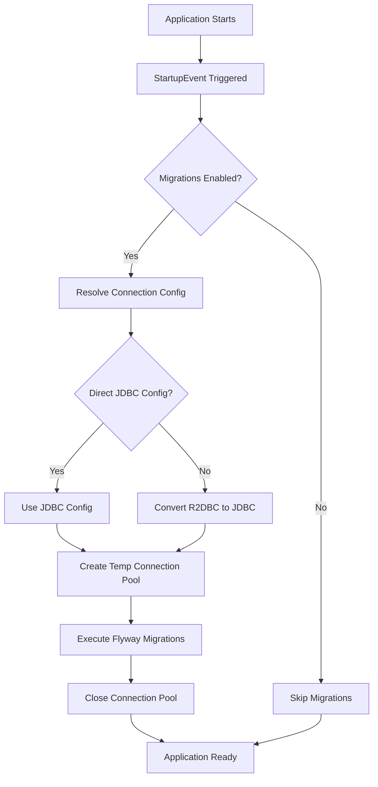

# How It Works

!!! info "Design Philosophy"
    This library is designed to provide Flyway migrations for R2DBC applications without the complexity and overhead of maintaining dual datasource configurations.

## Overview

The library operates on a simple principle: create JDBC connections only when needed for migrations, then immediately release them. This approach eliminates the memory overhead of persistent JDBC connection pools while maintaining full Flyway compatibility.

## Execution Flow



## Key Components

### 1. Event-Driven Activation

The migrator listens for Micronaut's `StartupEvent`:

```kotlin
@Context
@Requires(property = "flyway-r2dbc.enabled", value = "true")
class FlywayR2dbcMigrator : ApplicationEventListener<StartupEvent>
```

This ensures migrations run after the application context is fully initialized but before it starts accepting requests.

### 2. Connection Resolution

The connection resolver follows a fallback strategy:

1. **Check Direct JDBC Config**: If `flyway-r2dbc.url` is provided, use it directly
2. **Fallback to R2DBC**: Convert R2DBC configuration to JDBC format
3. **Error if Neither**: Clear error message if no configuration is found

### 3. URL Conversion

Database-specific converters handle R2DBC to JDBC URL transformation:

```
r2dbc:postgresql://localhost:5432/mydb?ssl=true
    ↓
jdbc:postgresql://localhost:5432/mydb?ssl=true
```

The conversion preserves:
- Host and port
- Database name
- Connection properties (with compatibility checks)
- Authentication credentials

### 4. Temporary Connection Pool

A minimal HikariCP pool is created with:

```kotlin
HikariConfig().apply {
    jdbcUrl = jdbcUrl
    username = username
    password = password
    maximumPoolSize = 2        // Flyway minimum
    minimumIdle = 0            // No idle connections
    idleTimeout = 10_000       // 10 seconds
    maxLifetime = 60_000       // 1 minute
    connectionTimeout = 30_000 // 30 seconds
}
```

Key characteristics:
- **Size**: Only 2 connections (Flyway's minimum requirement)
- **Lifetime**: Connections expire after 1 minute
- **Idle**: No persistent idle connections
- **Cleanup**: Pool is explicitly closed after migrations

### 5. Migration Execution

Standard Flyway execution with comprehensive error handling:

```kotlin
Flyway.configure()
    .dataSource(dataSource)
    .locations(*config.locations.toTypedArray())
    .baselineOnMigrate(config.baselineOnMigrate)
    .baselineVersion(config.baselineVersion)
    .baselineDescription(config.baselineDescription)
    // ... other config
    .load()
    .migrate()
```

### 6. Retry Logic

Built-in retry mechanism for transient failures:

```kotlin
repeat(config.connectionRetries) { attempt ->
    try {
        // Attempt migration
        return
    } catch (e: Exception) {
        if (attempt < config.connectionRetries - 1) {
            Thread.sleep(config.connectionRetryDelay.toMillis())
        }
    }
}
```

## Memory Efficiency

Traditional dual-datasource approach:

```
Application Memory:
├── R2DBC Connection Pool (10 connections)
├── JDBC Connection Pool (10 connections) ← Unused after startup
└── Application Components
```

This library's approach:

```
During Migration:
├── R2DBC Connection Pool (10 connections)
├── Temporary JDBC Pool (2 connections) ← Only during migration
└── Application Components

After Migration:
├── R2DBC Connection Pool (10 connections)
└── Application Components ← No JDBC overhead
```

## Error Handling

The library provides clear error messages for common issues:

### Missing Configuration
```
No database configuration found. Please provide either:
1. Direct JDBC configuration: flyway-r2dbc.url, username, password
2. R2DBC configuration: r2dbc.datasources.default.*
```

### Unsupported Database
```
Unsupported R2DBC URL format: r2dbc:mysql://...
Currently supported: postgresql
For unsupported databases, use direct JDBC configuration
```

### Connection Failures
Automatic retry with exponential backoff and detailed logging of each attempt.

## Transaction Isolation

Migrations run in their own transaction context, completely isolated from the application's R2DBC transaction manager. This prevents conflicts and ensures clean transaction boundaries.

## Next Steps

- Review the [Configuration Guide](../getting-started/configuration.md)
- Check the [Quick Start](../getting-started/quick-start.md)
- See the [Release Process](../development/release-process.md)